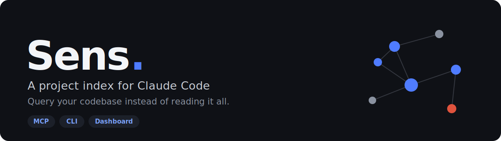
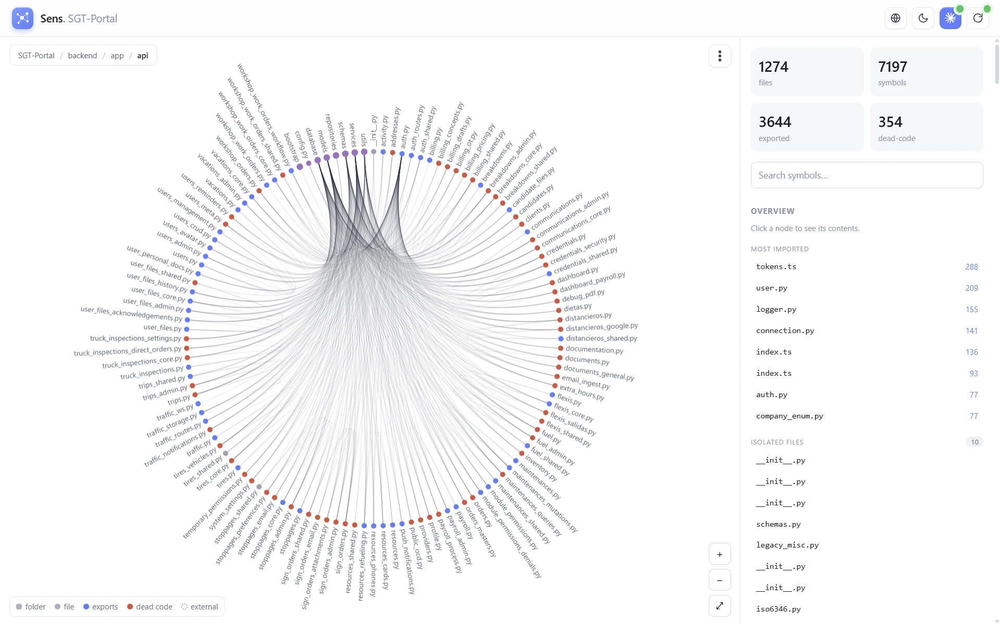
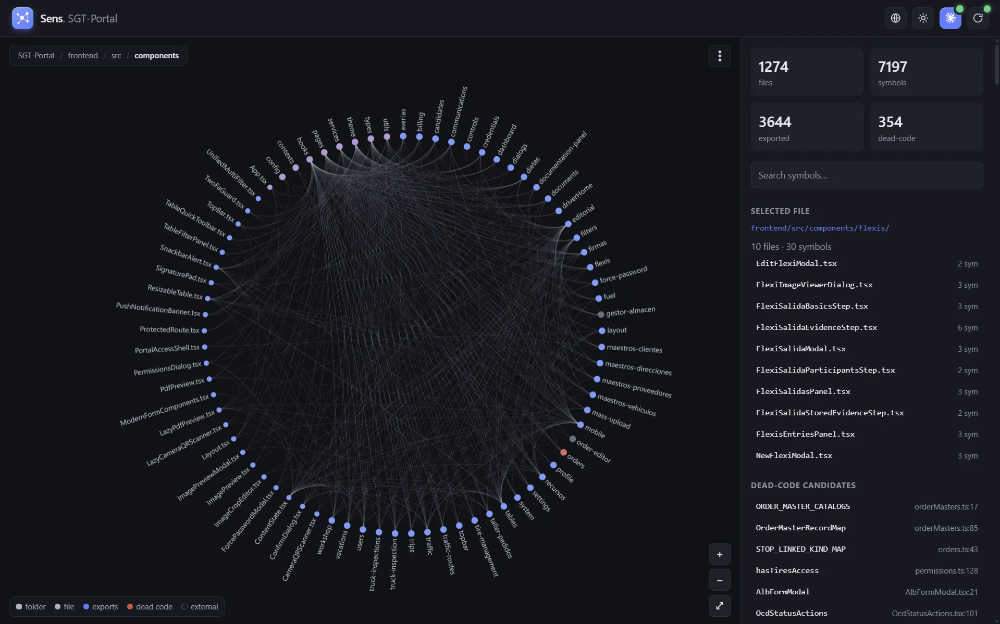

<p align="center">
  
</p>

<p align="center">
  <a href="https://www.npmjs.com/package/sens-mcp"></a>
  <a href="#license"></a>
  
  
  
  
</p>

<p align="center">
  <b>Let the model <i>query</i> your codebase instead of reading it all.</b><br>
  Fewer tokens, cleaner context, and a heads-up when code already exists or is dead.
</p>

---

## Why Sens?

If you use Claude Code on a **subscription**, your pain isn't a per-token bill — it's the **usage limit** and the **context window filling up**. Every time the agent opens 20 files just to orient itself, it burns your quota and bloats the context (which then compacts and quietly loses memory).

Sens keeps a compact **index** of your project and serves it to Claude over **MCP**, so the model asks focused questions instead of reading everything:

> *"where is `login`?"* · *"who uses it?"* · *"does something like this already exist?"* · *"what's dead code here?"*

One engine, two payoffs:

- 🪙 **Fewer tokens / cleaner context** → your subscription lasts longer and long sessions stay sharp.
- 🧹 **Cleaner code** → reuse what already exists instead of duplicating, and surface dead code.

> [!NOTE]
> Sens is **not** a "write-less" rules engine (that's what [ponytail](https://github.com/DietrichGebert/ponytail) does well). Sens is the missing piece underneath: the **project knowledge** that makes "reuse what exists" actually work. They're complementary.

## Contents

- [Quick start](#quick-start) · [What Claude gets](#what-claude-gets-mcp-tools) · [Slash commands](#slash-commands) · [CLI](#cli) · [Dashboard](#dashboard)
- [Does it actually help?](#does-it-actually-help) · [How it works](#how-it-works) · [Configuration](#configuration) · [Dead code](#dead-code--read-this) · [Roadmap](#roadmap) · [License](#license)

## Quick start

Add Sens as an MCP server. In your project's `.mcp.json` (or Claude Code's MCP config):

```json
{
  "mcpServers": {
    "sens": {
      "command": "npx",
      "args": ["-y", "sens-mcp", "mcp"]
    }
  }
}
```

Or register it once for **every** project:

```bash
claude mcp add sens -s user -- npx -y sens-mcp mcp
```

That's it. Claude Code launches Sens on demand — no per-project install, no manual server to run. Then just ask Claude naturally: *"use sens to map this project"*, *"any dead code? check with sens"*.

## What Claude gets (MCP tools)

| Tool | What it does | Replaces |
| --- | --- | --- |
| `project_map` | A one-screen map of the repo with each file's exports | Reading many files to orient |
| `find_symbol` | Where a symbol is defined (file:line + signature) | `grep` |
| `who_uses` | Every place a symbol is used | `grep` + reads |
| `file_outline` | A file's signatures, without its bodies | Reading the whole file |
| `already_exists` | Whether something matching keywords already exists | Duplicating by accident |
| `dead_code` | Unused symbols / exports (candidates) | — |
| `file_dependencies` | What a file imports and what imports it (import graph) | Grepping for imports across the project |

## Working rules

Sens's MCP server also hands Claude a short set of **working rules** it follows when writing or changing code — reuse what exists instead of duplicating, keep code minimal but maintainable, and leave nothing orphaned — each tied to the tool that lets it *verify* the rule (`already_exists`/`find_symbol` before writing, `dead_code` before finishing, `who_uses` before a rename). They load automatically over MCP; run `sens rules` to read them, or `sens rules --write` to drop a `SENS_RULES.md` you can reference from your `CLAUDE.md` / `AGENTS.md`.

## Slash commands

Sens also registers prompts, so it shows up in Claude Code's `/` menu:

| Command | Does |
| --- | --- |
| `/sens map` | Compact project map |
| `/sens dead-code` | List dead-code candidates |
| `/sens find <name>` | Locate a symbol |
| `/sens exists <keywords>` | Check for existing code before writing |
| `/sens rules` | Load the working rules and follow them |
| `/sens dashboard` | Open the web dashboard (graph) |

## CLI

You can also drive Sens yourself:

```bash
npx sens-mcp index          # build/update the index (cached by file mtime)
npx sens-mcp map [subdir]   # compact project map
npx sens-mcp find <name>    # where a symbol is defined
npx sens-mcp who <name>     # where a symbol is used
npx sens-mcp outline <file> # a file's signatures, no bodies
npx sens-mcp exists <kw...> # does something like this already exist?
npx sens-mcp dead-code      # unused symbols (candidates)
npx sens-mcp deps <file>    # what a file imports and what imports it
npx sens-mcp report         # self-contained HTML report → .sens/report.html
npx sens-mcp dashboard      # interactive web dashboard
npx sens-mcp rules          # print the coding rules (--write to save SENS_RULES.md)
npx sens-mcp usage          # which Sens tools the model has actually called
```

> Installed globally (`npm i -g sens-mcp`) the command is just `sens <command>`.

## Dashboard

`sens dashboard` starts a local web UI (default `http://localhost:4319`):

- an **interactive graph** of your project — files as nodes, imports as edges (drag, click a node to see its symbols);
- live **stats** and a clickable **dead-code** list;
- a symbol **search**;
- a one-click **Connect to Claude Code** (writes `.mcp.json`) and a **Rebuild index** button.

```bash
npx sens-mcp dashboard --root . --port 4319   # --no-open to skip opening the browser
```

<p align="center">
  
  <br><br>
  
</p>

<p align="center"><i>Nodes are files; blue = has exports, gray = internal, red = has dead code. Light &amp; dark themes, multiple graph layouts (network, chord, arc, treemap…).</i></p>

## Does it actually help?

A reproducible benchmark suite ([`bench/run.ts`](bench/run.ts)) measures this on Sens's own repo and fixtures — run it yourself with `npm run bench`. No estimates, no anecdotes: every number below comes straight from that script.

| Metric | Result | How it's measured |
| --- | --- | --- |
| Size to **orient** in a project | **~97% fewer characters** | `project_map` output vs. concatenating every file in `src/` |
| **Re-index** when nothing changed | **~100\u2013125\u00d7 faster** *(varies by run/hardware)* | median cold build (`force: true`) vs. median cached read, 5 runs each |
| **Duplication** | caught *before* writing | `already_exists("subtract two numbers")` surfaces the existing `subtract` |
| **Dead code** false positives | **0 out of 8** labeled symbols | against fixtures with known used / dead / object-shorthand-referenced symbols |

> Re-run `npm run bench` on your own machine or project to reproduce (or challenge) these numbers. Re-index speed varies with CPU and disk, so treat it as a range, not a fixed multiplier.

## How it works

Pluggable per-language parsers behind one language-agnostic index. Sens walks your source (respecting `.gitignore`), extracts top-level symbols with compact signatures, resolves references, and caches the result in `.sens/index.json` — only rebuilt when file mtimes change; a schema version invalidates stale caches across upgrades.

**Languages:**

- **JavaScript / TypeScript** (`.ts .tsx .js .jsx .mts .cts`) via [ts-morph](https://ts-morph.com) — cross-file references are resolved *semantically* (it follows your imports).
- **Python, Go, Rust, Java, C#, C, C++, PHP, Ruby, Kotlin** via [tree-sitter](https://tree-sitter.github.io/) — functions, classes/structs, methods, constants, and an import graph per file.

Everything lands in one language-agnostic index, so a mixed repo (e.g. a TS frontend + a Python or Go backend) is indexed as a single project. For the tree-sitter languages, cross-file references are resolved *by name* — the best a syntax-only parser can do without whole-program type inference — so `who_uses` / `dead-code` are slightly more approximate than for JS/TS: they over-count rather than miss, which keeps dead-code candidates conservative. Adding a language is a small self-contained parser (`src/indexer/languages/`); more are on the roadmap.

## Configuration

Optional `sens.config.json` at your project root:

```json
{
  "ignore": ["**/generated/**"],
  "entryPoints": ["src/public-api.ts"]
}
```

- **`ignore`** — extra globs to skip (on top of `.gitignore`, `node_modules`, `dist`).
- **`entryPoints`** — files whose exports are your public API, so they're never flagged as dead. `**/index.*` files are treated as entry points by default.

## Dead code — read this

Dead-code results are **candidates**, not certainties. Sens can't see:

- dynamic usage (string-based access, reflection);
- framework "magic" (e.g. Vue/Nuxt auto-imported components — SFC support is on the roadmap);
- a public API meant for external consumers (use `entryPoints`).

Test files count as usage sources but are never themselves reported as dead. **Verify before deleting.**

## Roadmap

- [ ] Enforcement hook (warn/block when an edit introduces dead code or a duplicate)
- [ ] Semantic `already_exists` (embeddings) + near-duplicate detection
- [ ] More languages via tree-sitter; Vue/Svelte SFCs
- [ ] Dashboard: symbol-level graph, live file watching
- [x] A reproducible benchmark suite (`npm run bench`)

## Contributing

Issues and PRs welcome. To develop locally:

```bash
npm install
npm run build      # bundle to dist/
npm test           # vitest
npm run typecheck
```

`npm link` makes `sens` a global command pointing at your local build.

## License

[MIT](LICENSE) — do what you want, just keep the copyright notice. See the note below on why.
