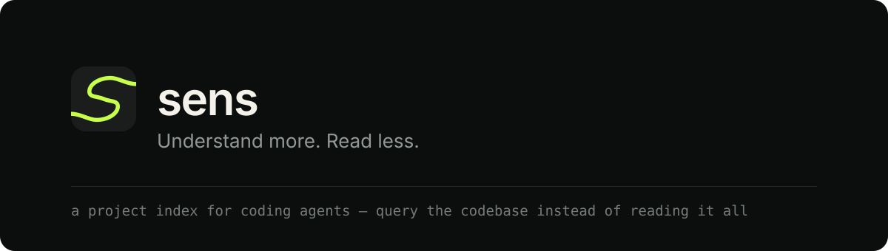
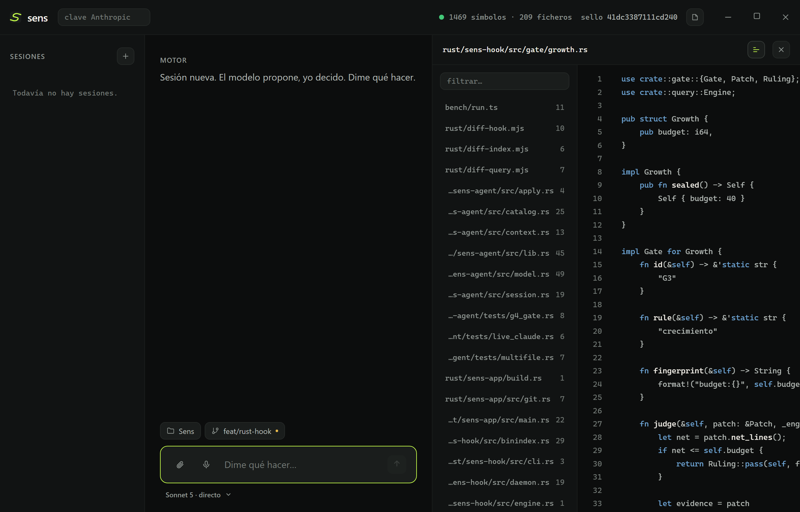
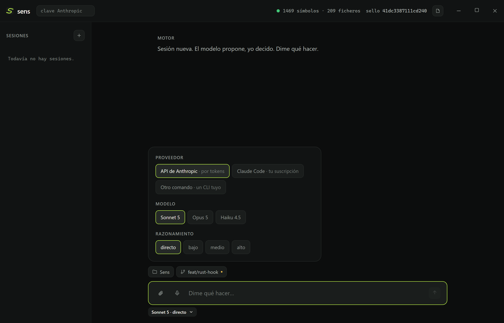

<p align="center">
  
</p>

<p align="center">
  <a href="#license"></a>
  
  
  
  
</p>

<p align="center">
  <b>A desktop coding agent over Claude Code, on your own subscription.</b><br>
  It chats with your project, shows every step the agent takes, and lets you pick the plugins, skills and MCP servers each project may use.
</p>

<p align="center">
  
</p>

> [!NOTE]
> Sens is in early development. There is no release to download yet — you build it yourself (see [Install](#install)). The packaged installer is Windows-only today; other platforms are untested. The interface is in Spanish.

---

## What it is

A window around the unmodified `claude` CLI. Sens never touches your Claude credentials: you sign in to Claude Code yourself, and Sens drives it over its own stream protocol — one process per session, resumed when you come back to it.

## How a session goes

1. **You open a folder.** Sessions live next to it, in `.sens/sessions`, and the sidebar groups them by project.
2. **You pick the model, effort, thinking and permissions.** The model list is the one Claude Code itself offers, read from it for free every day.
3. **You ask.** Text, pasted images and attached files. The reply streams in, and every tool call gets its own card: terminal output, search results, diffs, checklists, web sources, background tasks you can stop.
4. **You answer when it asks.** Permission requests, questions and plans arrive as prompts in the thread.
5. **The session names itself** after the first reply. Rename it from its `⋯` menu whenever you like.

## Capabilities

**Capacidades → Explorar** is a market of what Claude Code can load:

| Source | What |
| --- | --- |
| Anthropic | the official plugin directory, the knowledge-work, financial-services and life-sciences plugins, Anthropic's skills and its MCP connectors |
| Community | the third-party plugins Anthropic reviewed and pinned to a commit |
| skills.sh | the open skills index, searched as you type |

Every entry has a page with its readme, every file it ships and **what it runs** — hooks, MCP servers, executables and the variables it will ask for — before you install it. Installing downloads it once, pinned to a commit; enabling it is per project. Plugins reach the agent with `--plugin-dir`, never through your own Claude Code configuration.

<p align="center">
  
</p>

## The index underneath

Sens walks your source respecting `.gitignore`, extracts top-level symbols with compact signatures, resolves references and imports, and caches the result in `.sens/`. Only what changed gets rebuilt.

- **Go, Python, Rust, Java, C#, C, C++, PHP, Ruby, Kotlin** — indexed natively, in Rust, via [tree-sitter](https://tree-sitter.github.io/). References resolve by name, which over-counts rather than misses.
- **JavaScript / TypeScript** — resolved semantically with [ts-morph](https://ts-morph.com), which follows your imports properly. This path still runs through Node, so a JS/TS project needs Node 18+ on your machine.

A mixed repo is one project: a TypeScript frontend and a Go backend land in the same index.

## Install

There is no signed installer to download yet. To build it:

```bash
npm ci
npm run app:dev
```

That launches the app against your local sources. To produce the Windows installer instead:

```bash
npm run app:installer
```

It will refuse to build an unsigned one by accident. Give it a certificate from the Windows store with `SENS_SIGN_THUMBPRINT`, your own signing tool with `SENS_SIGN_COMMAND` (which must contain `%1`), or pass `--unsigned` when you know that is what you want. macOS needs notarization, which is a different certificate and a different story — not done yet.

## Develop

```bash
npm install
npm test                 # vitest, the indexer side
npm run test:native      # cargo test, the index engine and the gates
cargo test --manifest-path rust/sens-agent/Cargo.toml   # the chat engine
cargo test --manifest-path rust/sens-app/Cargo.toml     # the app: capabilities, market, sessions
npm run typecheck
npm run brand            # regenerate logo, icons and banner
```

Anything visual — interface, asset, terminal output, marketing — follows [the Sens visual identity](docs/brand/identity.md). Colours live in `src/brand/tokens.ts` and the mark's geometry in `src/brand/mark.ts`: import the token instead of retyping a hex, and edit the generator rather than the generated asset.

This repository does not take comments. Code explains itself with names and structure, or it gets extracted until it does.

## License

[MIT](LICENSE) — do what you want, just keep the copyright notice.
